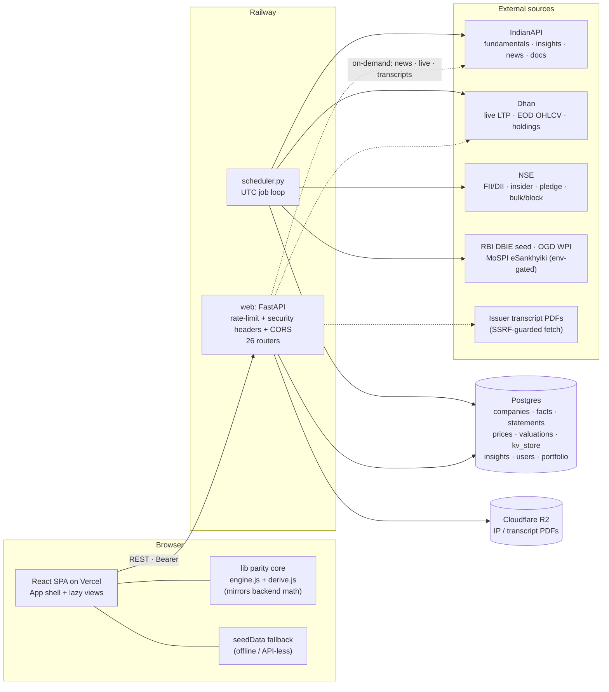
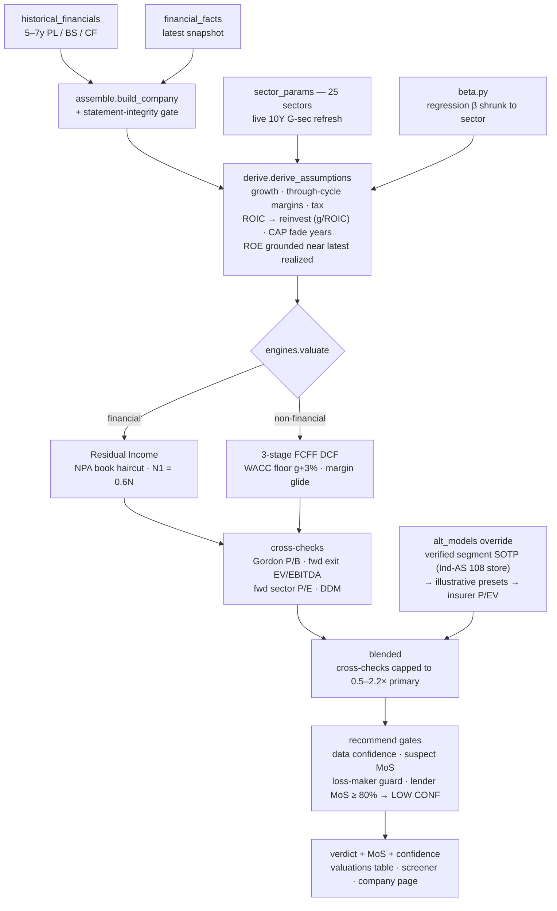

# Equity Terminal — System Architecture

> Living document. Reflects the codebase as of **17 Jul 2026** (post enterprise-audit).
> Anyone — you, a collaborator, or an assistant in a fresh session — should be able to read
> this and understand what exists, why, and how it fits, without re-deriving it from code.
> Companions: [HANDOFF.md](HANDOFF.md) (operating guide) · [CHANGES_2026-07.md](CHANGES_2026-07.md)
> (changelog) · FM_ENGINE_CHECKLIST.md (fund-manager roadmap).

---

## 1. Mission

An equity research terminal for Indian markets: type a ticker, get a complete, trustworthy
picture — financials, sector-correct valuation, asset quality, peers, the latest quarter's
story, and a defensible verdict — every number traceable to the filing it came from.

Bloomberg/FactSet are unbeatable on breadth; they are beatable on **focus and judgment**.
Two rules govern everything:

1. **Accurate enough for serious research.** A beautiful UI with wrong numbers is worse
   than useless. Missing data → an honest `NO DATA` / `LOW CONF`, never a fabricated input.
2. **100% AI-free.** All analysis is deterministic and auditable (lexicons, rules,
   arithmetic). There is no LLM call anywhere in the pipeline — by owner mandate.

---

## 2. System context

Two repos, three services, one Postgres:

| Piece | Repo | Host | Deploy |
|---|---|---|---|
| Frontend SPA | `~/equity-terminal` (React 18 + Vite) | Vercel | `git push main` → auto |
| Backend API (`web`) | `~/Downloads/backend` (FastAPI, 1× uvicorn) | Railway | `git push main` → auto; smoke `/api/health` after every push |
| Scheduler | same backend repo, `scheduler.py` | Railway (separate service) | same push |
| Database | Postgres (Railway) / SQLite locally | Railway | — |
| Documents | Cloudflare R2 (quarterly PDFs) | Cloudflare | — |



**Process rule:** web and scheduler are separate OS processes that share state **only via
Postgres** (including the `kv_store` key→JSON table). Module-level caches are per-process;
anything the web path must see fresh is re-read from the DB or schema-stamped
(`ENGINE_SCHEMA` on the FM evidence blob forces a boot rebuild when stale).

---

## 3. The valuation pipeline (the product's spine)

One deterministic path from a company's own filed statements to a verdict. No vendor
target anchoring; every assumption is derived, clamped, and disclosed (`_drivers`
provenance strings on each number).



**Conglomerates & insurers:** `alt_models.alternative_intrinsic` overrides the blend for
names a single-engine model mis-prices. Precedence: **verified segment store**
(`segment_sotp.py`, entered in-app from the filing's Ind-AS 108 table, segment EBIT ×
sector multiple + listed stakes at market value) → illustrative SOTP presets → insurer
P/EV appraisal. Always capped at MEDIUM confidence.

### One math core, two parity contracts

The SPA carries bit-faithful ports so every client-computed number reconciles with the
backend (fallback screener, DCF sliders, Monte Carlo, reverse DCF):

| Contract | Files | Harness | Must print |
|---|---|---|---|
| Engine | `src/lib/engine.js` ↔ `app/engines.py` + `sector_params` | `python tests/gen_parity_cases.py <fe>/tests/parityCases.json` → `node tests/engineParity.mjs` | **60/60** |
| Derive | `src/lib/derive.js` ↔ `app/derive.py` | `python tests/gen_derive_cases.py <fe>/tests/deriveCases.json` → `node tests/deriveParity.mjs` | **48/48** |

Re-run **both** after touching `engines.py`, `derive.py`, or `sector_params.py`.
`valuation.js` is a thin adapter over this core (the old second client engine was
collapsed 17 Jul 2026); `recommend.js` is the client trust layer and mirrors the
backend's lender-divergence gate.

---

## 4. Fund Manager v4 (evidence layer)

Triangulates evidence instead of trusting any one model: model FV × analyst consensus ×
the name's own 5-yr P/E–P/B bands, forensic quality, ownership flow, results momentum,
technicals, catalysts, news red-flags, macro regime. Suspect models are **set aside and
disclosed**, never silently reweighted.

- `manager_engine.py` — nightly evidence blob (`kv: fm_evidence_v1`, versioned by
  `ENGINE_SCHEMA`), conviction scoring, macro regime.
- `manager_calibration.py` — monthly Spearman-IC weight calibration on 5-yr history,
  walk-forward out-of-sample (`fm_calibration_v1`).
- `hidden_gems.py` — small/mid quality screen with hard honesty gates (symmetric
  extreme-MoS guard: a huge model gap on an under-covered name is treated as model
  error, not opportunity).
- `engine_calls` — the engine's own gradeable nightly ledger (public track record).
- Concall intelligence is **rules-based**: `transcript_ingester.py` fetches the PDF,
  extracts guidance/margins/capex/demand/risks + a lexicon tone score (boilerplate
  filtered), feeding sentiment (one of 4 legs) and FM conviction. No LLM.
- Leverage policy (deliberate): the manager never recommends pledging/borrowing to
  invest — capital rotation instead.

## 5. Scheduler (all times UTC; IST = UTC+5:30)

| Time (UTC) | Job |
|---|---|
| Mon–Fri 10:15 | EOD price refresh (full visible set) + Dhan top-up + verdict snapshots |
| Mon–Fri 10:45 | Missing-history backfill |
| Mon–Fri 11:15 | FM evidence rebuild (`fm_evidence_v1`) |
| Daily 01:00 | Transcript ingest (bounded slice; book cycles ~weekly) |
| Daily 02:00 | Regulatory RSS (RBI + SEBI) |
| Daily 02:30 | NSE flows (FII/DII, insider, pledge, bulk/block) |
| Every 90 min, 03:45–10:05 | Intraday spot prices (market hours; 1 request) |
| Fri 21:00 | FM calibration (monthly, first Friday) |
| Fri 21:30 | Universe refresh (monthly, first Friday) |
| Fri 22:30 | Results calendar (board meetings) |
| Sun 00:30 | Weekly full refresh (rolling fundamentals cohort) |
| Sun 23:30 | Macro refresh (DBIE / OGD / MoSPI, env-gated) |

## 6. Data model (Postgres; `app/models.py`)

| Group | Tables |
|---|---|
| Identity & audit | `users`, `auth_events` |
| Universe & fundamentals | `companies`, `financial_facts`, `historical_financials`, `company_insights` (JSON blob: analyst, forecasts, peers, ratios, docs, ownership, results) |
| Prices | `market_snapshots` (latest), `historical_prices` (5-yr OHLCV, unique `(company_id, date)`), `price_points` |
| Model outputs | `valuations` (precomputed screener), `verdict_snapshots` + `engine_calls` (track record), `alpha_snapshots`, `consensus_snapshots`, `transcript_insights` |
| User state | `portfolio_holdings`, `watchlist_items`, `saved_scenarios` (HMAC share links), `saved_screens` |
| Shared KV (`kv_store`) | FM evidence/calibration · verified segment SOTP (`segment_financials_v1`) · news sentiment · NSE feeds (insider/pledge/bulk-block) · regulatory feed · macro overlay · digest snapshots · investable cash · shared Dhan token |
| Documents & ops | `quarterly_documents` (R2 keys), `corporate_actions`, `api_usage` |

## 7. API surface (26 routers, `app/main.py`)

- **Public research:** companies list/detail, financials, history, market, profile,
  news, documents (+ rules-based transcript summary), ownership, results, operations,
  compare, IPO, MF, intraday, macro/economy, backtest (read), quality, logo.
- **Authenticated (Bearer):** auth, portfolio (+ digest / analysis / xray / cash),
  watchlist, scenarios, screens, Dhan sync, exports (Excel / one-pager PDF).
- **Admin (`ADMIN_EMAILS`, every route `require_admin`, fails closed):** users &
  auth events, ingestion triggers (backfill, transcripts, NSE flows, macro upload),
  segment financials (GET/POST/DELETE), BSE fetch, backtest snapshot, engine rebuild.
- Retired stubs kept for contract stability: `/thesis` and the LLM-era
  transcript-summary shape both return an honest "retired/unavailable".

## 8. Security posture (post-audit, 17 Jul 2026)

- **Auth:** HMAC-SHA256 tokens (constant-time compare, enforced expiry), Bearer header,
  PBKDF2-260k passwords. `AUTH_SECRET` **fails fast in prod** if unset.
- **Rate limiting:** per-IP sliding window (240/min general, 10/min auth). Client IP is
  taken `TRUSTED_PROXY_HOPS` (default 1) from the **right** of `X-Forwarded-For`
  (the leftmost hop is client-spoofable); buckets are swept and capped.
- **Object authorization:** every user-scoped query filters by `user_key` — no IDOR.
- **SSRF guard:** outbound transcript fetches allow http/https to **public IPs only**
  (loopback / RFC-1918 / link-local / metadata blocked), every redirect re-validated.
- **Headers/CORS:** nosniff, X-Frame-Options DENY, strict referrer. CORS wildcard is
  safe here: `allow_credentials=False` and auth is Bearer-only (no cookies).
- **No SQL outside the ORM.** No LLM/external-AI calls anywhere.

## 9. Environment variables

| Var | Service | Notes |
|---|---|---|
| `AUTH_SECRET` | web | **mandatory in prod** — boot fails without it |
| `ADMIN_EMAILS` | web | comma-separated admin allowlist (gate fails closed) |
| `DATABASE_URL` | both | Postgres in prod; SQLite default locally |
| `INDIANAPI_KEY` | both | sole fundamentals/news vendor (quota-budgeted) |
| `DHAN_*` + TOTP vars | both | live prices, EOD, holdings; token self-renews via KV |
| `TRUSTED_PROXY_HOPS` | web | default 1 (Railway edge); tune if real users hit 429s |
| `RATE_LIMIT_GENERAL` / `RATE_LIMIT_AUTH` | web | defaults 240 / 10 per minute |
| `FRONTEND_ORIGIN` | web | CORS pin (default `*`, safe — no credentials) |
| `UNIVERSE_TIER` | both | `nifty100` (default) / `nifty250` / `nifty500` |
| `OGD_KEY`, `OGD_WPI_URL`, `MOSPI_KEY`, `MOSPI_CPI_URL`, `MOSPI_IIP_URL` | scheduler | macro fetchers (owner-registered keys) |
| `R2_*` | both | document store credentials |
| `VITE_API_URL` | frontend | backend base URL (Vercel env) |

## 10. Verification runbook

```bash
# backend (~/Downloads/backend; system python3 lacks deps — use venv313)
venv313/bin/python -m pytest tests/ -q                       # must: 191+ pass
venv313/bin/python tests/gen_parity_cases.py <fe>/tests/parityCases.json
venv313/bin/python tests/gen_derive_cases.py <fe>/tests/deriveCases.json

# frontend (~/equity-terminal)
node tests/engineParity.mjs                                  # must: 60/60
node tests/deriveParity.mjs                                  # must: 48/48
npm run build

# after EVERY backend push — before any feature-specific polling
curl https://<railway-domain>/api/health                     # must: {"status":"ok"}
```

Conventions: never `git add -A` in the backend repo (untracked scratch files) — stage
explicit paths. Keep this document synchronized when the system changes.
